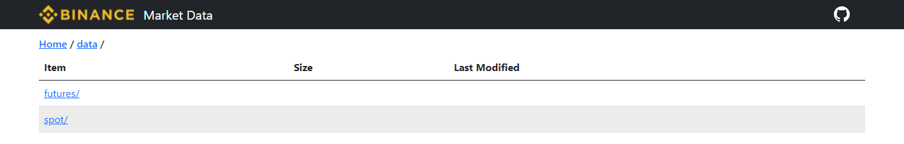

# binance-public-data-download
python script to download binance public data from https://data.binance.vision/



### Example
We want to download ```klines``` of USDT-margined futures data ```futures/um``` of ```BTCUSDT``` (which means any crypto type containing the key word ```BTCUSDT```; they are ```BTCUSDT, BTCUSDT_210625, BTCUSDT_210924, BTCUSDT_211231```) and save the data in filefolder ```data```.

Run
```
python binance_public_data_download.py --spot_or_future futures --coin_m_or_usdt_m_for_future um --data_type klines --crypto_type BTCUSDT --delta_time 1m --output_path data
```

### Running with arguments
| Argument                              | Explanation |         
| ------------------------------------- | ---------------- |
| ```--spot_or_future```                | to download spot or future, input ```spot``` for spot and ```futures``` for future| 
| ```--coin_m_or_usdt_m_for_future```   | coin-margined: ```cm```, usdt-margined: ```um```, this item will be ignored when ```spot``` is used| 
| ```--data_type```                     | data_type: ```klines```, ```trades```, ```aggTrades```, ... which can be checked in https://data.binance.vision/| 
| ```--crypto_type```                   | the program will find all the symbols containing the key word you input; e.g. input ```BTC``` and all the items containing ```BTC``` will be downloaded| 
| ```--delta_time```                    | resolution of the crypto data, which can be checked in https://data.binance.vision/, default: ```1m``` (1 minute)| 
| ```--output_path```                   | path to save the data | 
